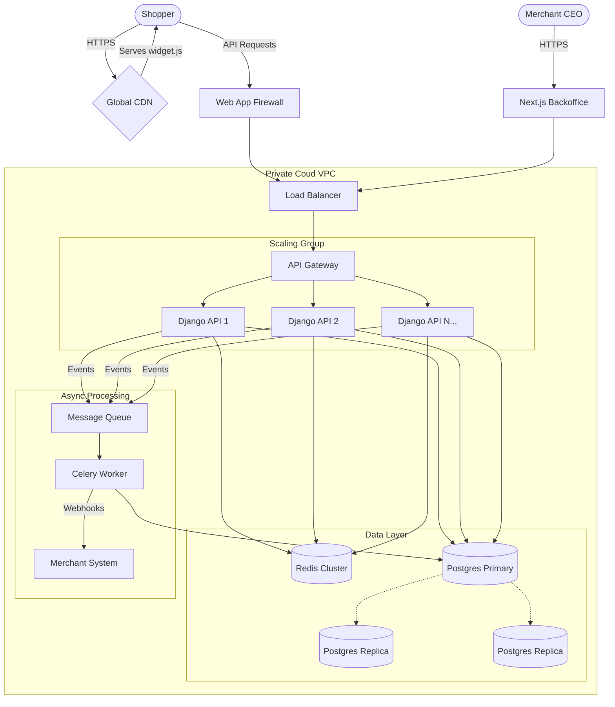

# SuperPayment: Design Challenge & Scaling Strategy

## 1. Business Model

**"SuperPayment helps online shops sell more by letting customers pay instantly with vouchers they already own. We charge a small commission on each sale in exchange for making the checkout process faster and easier."**
*Rationale: We know that hard checkouts make people leave without buying. By making it simple (one click), we help shops get more completed orders, so they are happy to pay us a service fee for helping them grow.*
---

## 2. Minimal Systems Architecture (Production Ready for €10M MRR)

To support **thousands of merchants** and **hundreds of thousands of daily transactions**, we move from our local Docker setup to a **Cloud-Native Auto-Scaling Architecture**. This ensures 99.99% availability, critical for payments. For example AWS.

### High-Level Components Map

1.  **Global CDN (CloudFront)**: Serves the [widget.js](../widget/widget.js) static file from the edge (milliseconds latency anywhere in the world).
2.  **Load Balancer (ALB/Nginx)**: Distributes incoming API traffic across multiple backend instances.
3.  **API Gateway**: Handles Rate Limiting, API Key Verification (security layer), and Routing.
4.  **Application Cluster (Django)**: Stateless containerized (ECS) instances that auto-scale based on CPU/Request load.
5.  **Database Cluster (PostgreSQL)**:
    *   **Primary**: Handles Writes (Transactions).
    *   **Read Replicas**: Handle Reads (Dashboard Analytics, Reporting) to offload the master.
6.  **Redis Cluster**: Handles Session storage, Caching, and high-speed Deduplication (preventing double payments).
7.  **Async Workers**: Offloads heavy tasks (sending emails, webhooks to merchants, fraud checks) from the main payment request loop.

### Production Architecture Diagram



---

## 3. Integration Specifics

We only ask the Merchant for **two** touchpoints. Simplicity is key to adoption.

### A. What needs to be integrated

1.  **The Widget Script**: The merchant adds one line of code to their checkout page.
    ```html
    <script src="https://cdn.superpayment.com/widget.js" 
            data-api-key="MERCHANT_PUBLIC_KEY" 
            data-amount="99.00" 
            data-order-id="ORDER_123">
    </script>
    ```
2.  **The Webhook Endpoint (Optional but recommended)**: An API endpoint on the Merchant's server to receive "Payment Success" notifications from SuperPayment (server-to-server confirmation), ensuring users can't fake frontend success messages.

### B. APIs Required

*   **`POST /api/process-payment/`**: Called by the Widget. Handles the heavy lifting.
*   **`POST /api/verify-transaction/`**: (Server-Side) Called by the Merchant's backend to verify a transaction status before releasing goods.

---

## 4. Platforms & Frameworks

### Technology Stack

*   **Core Backend: Python & Django**
    *   *Why?* "Batteries included". Security (CSRF, XSS, SQL Injection protection) is built-in. The ORM allows rapid iteration on complex data models. Great for financial math (decimal types).
*   **Database: PostgreSQL**
    *   *Why?* ACID compliant (Atomicity, Consistency, Isolation, Durability) is non-negotiable for money. JSONB fields allow flexible schema evolution for different Voucher types.
*   **Frontend: Next.js (React)**
    *   *Why?* Server-Side Rendering (SSR) for the Backoffice ensures speed and SEO. React's component model is perfect for building complex dashboards.
*   **Infrastructure: Docker & Kubernetes**
    *   *Why?* Standardization. Dev = Prod. AWS allows us to scale the Backend/Frontend containers independently from the Database.

### Technologies to Avoid

*   **Serverless (Lambda/Cloud Functions) for Core Checkout**:
    *   *Why?* **Cold Starts**. If a function sleeps, the first user waits 2+ seconds. In checkout, every second of delay drops conversion by ~7%. We need "always-on" warm servers for the payment path.
*   **NoSQL (MongoDB/DynamoDB) as Primary Ledger**:
    *   *Why?* Lack of strict relational integrity / complex ACID transactions across documents makes financial auditing a nightmare. Use Relational for the Ledger.

### Cost & Comparative (Cloud vs. Bare Metal)

| Strategy | Setup Cost | Monthly Cost | Scaling Speed | Recommendation |
| :--- | :--- | :--- | :--- | :--- |
| **PaaS (Heroku/Vercel)** | Very Low | High (€€€) | Instant | **Phase 1 (Start)** |
| **Cloud AWS** | High | Medium (€€) | Fast (Minutes) | **Phase 2 (Growth)** |
| **Bare Metal** | High | Low (€) | Slow (Days) | Avoid until huge scale |

**Why Cloud AWS?**
For €10M MRR, we cannot rely on single servers. AWS offer managed RDS (Postgres) which handles backups, failover, and replication automatically. This "peace of mind" costs more than raw metal but is cheaper than a dedicated DevOps team managing DB replication manually. It provides the exact "Boxes" the CFO needs to see to believe in stability.
