# 🚀 SuperPayment
## Global Scaling Strategy
### From Local Docker to Cloud Native


---

# 1. Business Model
### "Instant Vouchers = Higher Conversion"

> **Problem**: Hard checkouts kill sales.
> **Solution**: One-click payments using existing vouchers.

- **Value Prop**: We help shops sell more.
- **Revenue**: Commission on successful sales.
- **Goal**: €10M MRR via frictionless experience.

---

# 2. Production Architecture (AWS)

```mermaid
graph TD
    subgraph Cloud["☁️ AWS Cloud VPC"]
        LB[Load Balancer] --> API{API Gateway}
        API --> Django[Django Application Cluster]
        Django --> Redis[(Redis Cache)]
        Django --> DB[(Postgres Primary)]
        DB -.-> Read[(Read Replica)]
        
        Django -.-> Workers[Async Workers]
    end
    
    User([Shopper]) --> CDN[Global CDN]
    CDN --> User
    User --> LB
    
    style Cloud fill:#2a2a3e,stroke:#4a4a5e,color:#fff
    style LB fill:#f48fb1,stroke:#333
    style API fill:#90caf9,stroke:#333
    style Django fill:#a5d6a7,stroke:#333
    style DB fill:#ffcc80,stroke:#333
```



- **Global CDN**: Millisecond latency for `widget.js`.
- **Auto-Scaling**: Django containers expand with load.
- **Reliability**: Primary DB + Read Replicas for analytics.

---

# 3. Simple Integration
**2 Touchpoints Only**

1. **Frontend**: 1 Line of Code
   ```html
   <script src="https://cdn.superpayment.com/widget.js" 
           data-api-key="PK_123" 
           data-amount="99.00"
           data-order-id="ORDER_123">
   </script>
   ```

2. **Backend**: Webhook Verification
   - Server-to-server confirmation.
   - Prevents frontend spoofing.

---

# 4. Modern Tech Stack

| Component | Tech | Why? |
| :--- | :--- | :--- |
| **Backend** | 🐍 **Python/Django** | "Batteries included" security, financial math. |
| **Database** | 🐘 **PostgreSQL** | ACID compliance, JSONB for flexible vouchers. |
| **Frontend** | ⚛️ **Next.js** | SEO, Server-Side Rendering for Dashboard. |
| **Infra** | 🐳 **Docker/K8s** | Dev = Prod parity. |

---

# 5. Cost & Scaling Strategy

| Strategy | Setup | Monthly | Scaling | Verdict |
| :--- | :---: | :---: | :---: | :--- |
| **PaaS** (Vercel) | ⚡ Low | 💸 High | 🚀 Instant | **Start Here** |
| **Cloud** (AWS) | ⚙️ High | 💰 Medium | 🏎️ Fast | **Growth Phase** ✅ |
| **Bare Metal** | 🛠️ High | 💵 Low | 🐢 Slow | **Avoid (for now)** 🛑 |

> **Recommendation**: Move to **AWS** for the €10M MRR milestone. 
> Managed services = Stability = CFO Confidence.
