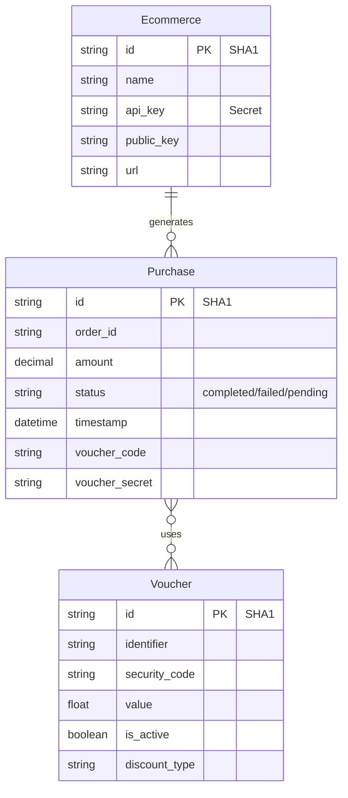

## Database Schema (ER Diagram)

```mermaid
erDiagram
    Ecommerce ||--o{ Purchase : "generates"
    Purchase }o--o{ Voucher : "uses"
    
    Ecommerce {
        string id PK "SHA1"
        string name
        string api_key "Secret"
        string public_key
        string url
    }

    Voucher {
        string id PK "SHA1"
        string identifier
        string security_code
        float value
        boolean is_active
        string discount_type
    }

    Purchase {
        string id PK "SHA1"
        string order_id
        decimal amount
        string status "completed/failed/pending"
        datetime timestamp
        string voucher_code
        string voucher_secret
    }
```
