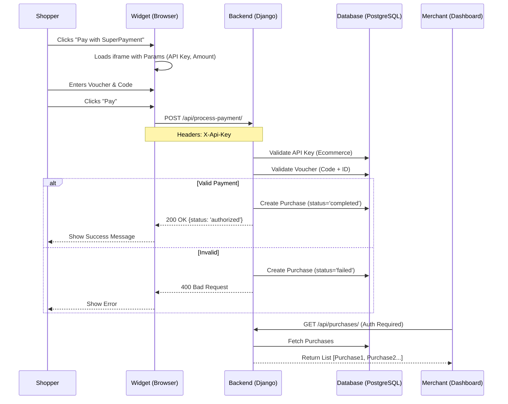

# SuperPayment Architecture

## Payment Flow Sequence

```mermaid
sequenceDiagram
    participant Shopper
    participant Widget (Browser)
    participant Backend (Django)
    participant Database (PostgreSQL)
    participant Merchant (Dashboard)

    Shopper->>Widget (Browser): Clicks "Pay with SuperPayment"
    Widget (Browser)->>Widget (Browser): Loads iframe with Params (API Key, Amount)
    Shopper->>Widget (Browser): Enters Voucher & Code
    Shopper->>Widget (Browser): Clicks "Pay"
    Widget (Browser)->>Backend (Django): POST /api/process-payment/
    Note over Widget (Browser),Backend (Django): Headers: X-Api-Key
    Backend (Django)->>Database (PostgreSQL): Validate API Key (Ecommerce)
    Backend (Django)->>Database (PostgreSQL): Validate Voucher (Code + ID)
    alt Valid Payment
        Backend (Django)->>Database (PostgreSQL): Create Purchase (status='completed')
        Backend (Django)-->>Widget (Browser): 200 OK {status: 'authorized'}
        Widget (Browser)-->>Shopper: Show Success Message
    else Invalid
        Backend (Django)->>Database (PostgreSQL): Create Purchase (status='failed')
        Backend (Django)-->>Widget (Browser): 400 Bad Request
        Widget (Browser)-->>Shopper: Show Error
    end

    Merchant (Dashboard)->>Backend (Django): GET /api/purchases/ (Auth Required)
    Backend (Django)->>Database (PostgreSQL): Fetch Purchases
    Backend (Django)-->>Merchant (Dashboard): Return List [Purchase1, Purchase2...]
```
